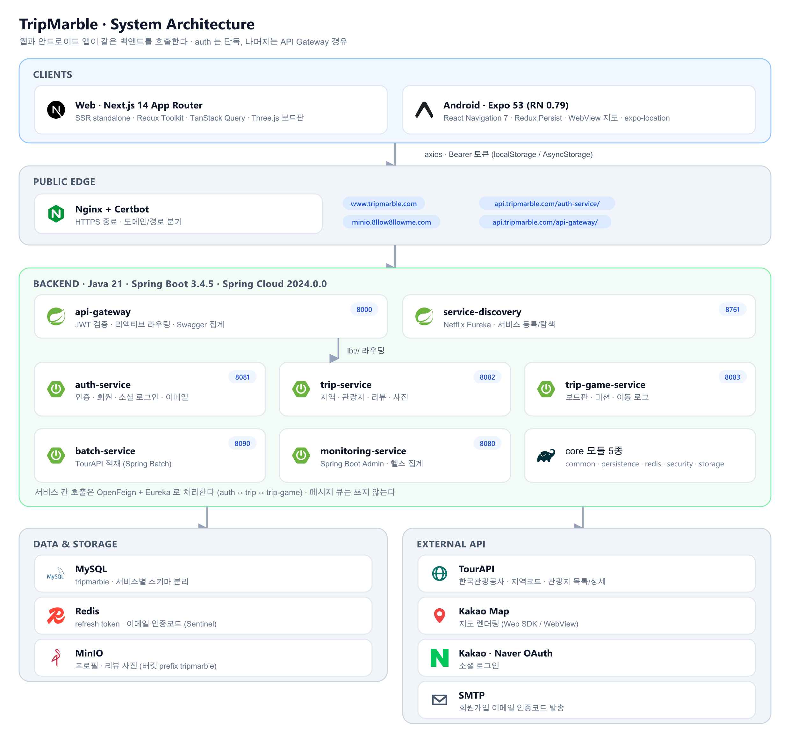
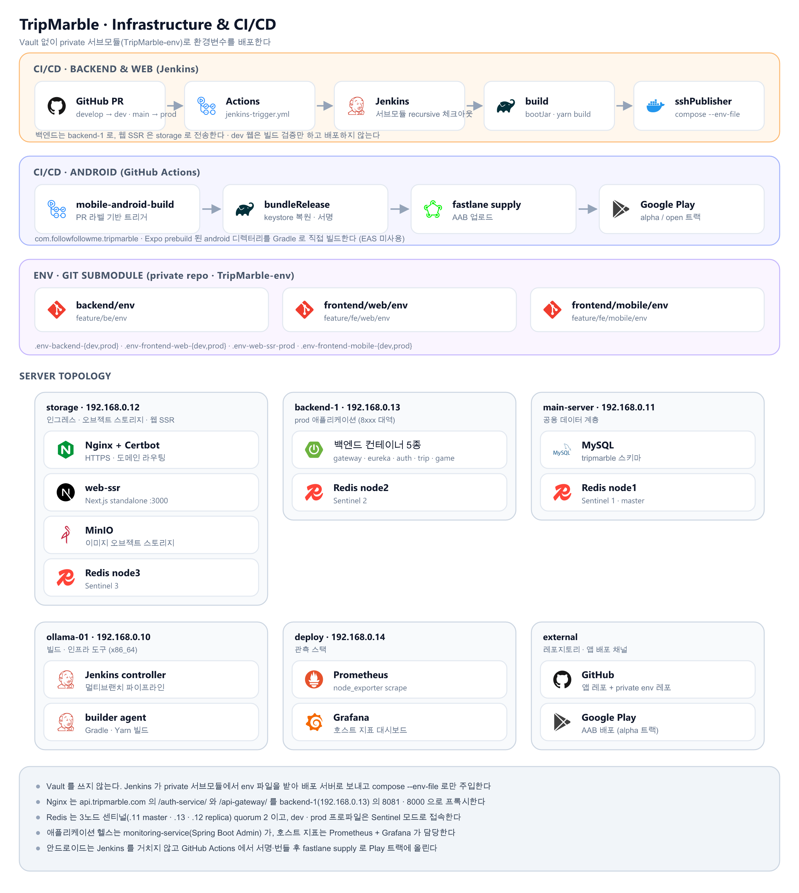

# TripMarble (트립마블)

> 한국관광공사 TourAPI 관광지 데이터로 보드판을 만들고, 미션을 수행하며 여행을 기록하는 게이미피케이션 웹·앱 서비스
>
> 가고 싶은 지역과 테마를 고르면 **관광지가 칸으로 놓인 보드판**이 생깁니다. 주사위를 굴려 이동한 칸의 관광지에서 후기나 위치 인증 미션을 수행하면, 그 과정이 그대로 여행 기록으로 남습니다.

| 항목 | 내용 |
| --- | --- |
| 프로젝트명 | TripMarble (트립마블) |
| 한 줄 소개 | TourAPI 관광지 데이터 기반 보드게임형 여행 기록 서비스 |
| 출품 | 2025 한국관광공사 × 카카오 관광데이터 활용 공모전 |
| 개발 기간 | 2025.05 ~ 2025.12 |
| 타겟 | 목적지를 정하지 못한 여행자, 여행 과정을 기록으로 남기고 싶은 사용자, 친구와 함께 여행 코스를 굴려보고 싶은 그룹 |
| 서비스 | `www.tripmarble.com` (웹) · `api.tripmarble.com` (API) · Google Play `com.followfollowme.tripmarble` (안드로이드) |

## 설계 포인트

- **MSA**: Eureka + Spring Cloud Gateway 기반으로 인증 / 관광지 / 게임 / 배치 / 모니터링 서비스 분리, 서비스 간 호출은 OpenFeign
- **Hexagonal Architecture**: `Controller → WebUseCase → WebFacade → Processor → Port/Adapter` 계층 규약을 전 서비스에 통일
- **웹 · 앱 동시 제공**: Next.js 14 App Router(SSR standalone)와 Expo 53(React Native)이 같은 백엔드 API를 사용
- **TourAPI 배치 파이프라인**: 지역코드 → 관광지 목록 → 관광지 상세를 Spring Batch 잡으로 단계 적재하고, 이 데이터를 보드판 칸으로 사용
- **Vault 없는 환경변수 관리**: 시크릿 서버 대신 **private 레포를 Git Submodule로 붙여** 환경변수를 배포 (→ [환경변수 관리](#환경변수-관리))

## 주요 기능

| 영역 | 기능 |
| --- | --- |
| 회원 | 이메일 인증 회원가입·로그인, 카카오/네이버 소셜 로그인, 프로필 수정·이미지 업로드, 탈퇴, 활동 요약(작성 리뷰·플레이 게임 수) |
| 관광지 탐색 | 시도 → 시군구 → 대표 지역 탐색, 지역 검색, 대표 지역별 관광지 목록, 관광지 상세(주소·좌표·대표 이미지·개요), 카카오 지도 |
| 보드판 생성 | 대표 지역 + 테마 + 여행 기간 + 난이도(EASY 11칸 · NORMAL 15칸 · HARD 19칸)로 보드판 생성, 칸마다 관광지와 미션 타입 배정 |
| 게임 진행 | 방 참가·준비, 방장 시작 시 턴 순서 셔플, 주사위(1~6) 이동, 이동 로그 적재, 마지막 칸 도달 시 종료 또는 방장 강제 종료, 재입장 |
| 미션 | 도착한 칸의 관광지에서 **후기 작성(REVIEW)** 또는 **위치 인증(CHECKIN_GPS)** 수행, 성공·건너뛰기·실패를 이동 로그에 기록 |
| 여행 기록 | 게임별 타임라인과 이동 로그, 종료된 게임 다시보기, 내가 작성한 리뷰 목록 |
| 리뷰 | 관광지 별점·후기 작성, 사진 업로드(MinIO), 관광지별 리뷰 목록·요약, 내 리뷰 삭제 |
| 관광 데이터 적재 | TourAPI 배치로 시도/시군구 법정동코드, 지역 기반 관광지 목록, 관광지 공통 상세 정보를 적재 |

> 위치 인증 미션(`CHECKIN_GPS`)은 도메인 모델과 앱 화면까지 준비되어 있고, 인증 API 연결이 남아 있습니다.

## 시스템 아키텍처

### 전체 구성



**핵심 흐름**

- 웹과 앱은 같은 두 진입점을 씁니다. `auth-service`는 게이트웨이를 거치지 않고 단독 호출하고, 관광지·게임 API는 게이트웨이가 JWT를 1차 검증한 뒤 Eureka `lb://`로 라우팅합니다. Swagger는 게이트웨이가 3개 서비스 문서를 집계합니다.
- 토큰은 클라이언트가 보관합니다. 웹은 localStorage, 앱은 AsyncStorage(Redux Persist)에 두고 axios 인터셉터가 `Authorization` 헤더를 붙입니다. 401이면 `/auth/token/reissue`로 재발급 후 1회 재시도하고, 실패하면 로그아웃 처리합니다.
- 보드판은 미리 적재된 TourAPI 관광지에서 만들어집니다. `trip-game-service`가 대표 지역·테마 조건으로 `trip-service`에 관광지를 요청(OpenFeign)해 칸을 채우고, 후기 미션이 성공하면 다시 `trip-service`에 리뷰 생성을 위임합니다.

### 백엔드 모듈

| 구분 | 모듈 | 책임 | 내부 포트 |
| --- | --- | --- | --- |
| cloud | `service-discovery` | Eureka 서비스 레지스트리 | 8761 |
| cloud | `api-gateway` | 라우팅, JWT 1차 검증, CORS, Swagger·에러코드 집계 | 8000 |
| service | `auth-service` | 인증, 회원, 소셜 로그인, 이메일 인증, 프로필 이미지 | 8081 |
| service | `trip-service` | 지역·대표 지역, 관광지, 콘텐츠 타입, 리뷰 | 8082 |
| service | `trip-game-service` | 테마, 보드판·타일, 게임 진행, 미션, 이동 로그 | 8083 |
| service | `batch-service` | TourAPI 데이터 적재 (Spring Batch) | 8090 |
| service | `monitoring-service` | Spring Boot Admin 기반 헬스·인스턴스 집계 | 8080 |
| core | `common-core` / `persistence-core` / `redis-core` / `security-core` / `storage-core` | 공통 응답·Swagger·Jasypt, JPA·QueryDSL·Snowflake, Redis 설정, JWT 보안, MinIO 스토리지 | — |

계층 규약은 서비스 전반에 동일하게 적용됩니다.

```
Controller → WebUseCase → WebFacade → Processor → Port → Adapter
                              ↘ Presenter (Info → Response 변환 전담)
```

사용자 트래픽을 받는 5종(`api-gateway`, `service-discovery`, `auth-service`, `trip-service`, `trip-game-service`)만 컨테이너로 상시 배포하고, `batch-service`와 `monitoring-service`는 필요할 때 직접 실행합니다.

배치 잡은 CLI 디스패처로 실행하며, 잡 이름을 주지 않으면 배치가 돌지 않습니다.

| 잡 | 적재 대상 | TourAPI |
| --- | --- | --- |
| `regionJob` | 시도 / 시군구 법정동코드 | 지역코드 조회 |
| `tripSpotJob` | 지역 기반 관광지 목록 | 지역기반 관광정보 조회 |
| `tripSpotDetailJob` | 관광지 주소·좌표·대표 이미지·개요 | 공통정보 조회 |

### 환경변수 관리

시크릿 서버를 두는 대신 **환경변수 전용 private 레포 하나를 브랜치로 쪼개** 세 위치에 Git Submodule로 붙였습니다.

```
TripMarble-env (private)
├── feature/be/env         → backend/env           : .env-backend-dev · .env-backend-prod
├── feature/fe/web/env     → frontend/web/env      : .env-frontend-web-{dev,prod} · .env-web-ssr-prod
└── feature/fe/mobile/env  → frontend/mobile/env   : .env-frontend-mobile-{dev,prod}
```

| 대상 | 주입 방식 |
| --- | --- |
| 백엔드 | `docker compose --env-file env/.env-backend-{dev,prod}` → `application-{dev,prod}.yml`의 `${...}` 플레이스홀더로 치환 |
| 웹 | `next.config.mjs`가 `dotenv`로 `./env/.env-frontend-web-{dev,prod}` 로드, SSR 컨테이너는 `.env-web-ssr-prod`를 compose로 주입 |
| 앱 | `app.config.ts`가 `APP_ENV` / `EAS_BUILD_PROFILE` 기준으로 해당 env 파일 로드 |
| CI | Jenkins는 `SubmoduleOption(recursive, parentCredentials)`, GitHub Actions는 `submodules: recursive` + PAT로 서브모듈까지 체크아웃 |
| 로컬 | `application-local.yml`의 Jasypt `ENC(...)` 값 + 외부에서 주입하는 암호화 키 |

클론할 때 서브모듈을 함께 받아야 합니다. private 레포 접근 권한이 없으면 env 디렉터리는 비어 있습니다.

```bash
git clone --recurse-submodules https://github.com/8llow8llowMe/TripMarble.git
```

### 인프라 구성 및 CI/CD

인프라는 별도 IaC 레포(`Infra`)에서 Docker Compose + 셸 스크립트로 관리합니다.



| 영역 | 구성 |
| --- | --- |
| 리버스 프록시 | Nginx + Certbot(Let's Encrypt), HTTP→HTTPS 강제, apex → www 정규화, 경로별 백엔드 분기 |
| 애플리케이션 | `backend-1`(192.168.0.13)에 컨테이너 5종(gateway · eureka · auth · trip · trip-game)을 compose로 배포, `-dev` / `-prod` 접미사로 분리 |
| 웹 SSR | `storage`(192.168.0.12)에서 Next.js standalone 컨테이너(`web-ssr:3000`) 운영 |
| 데이터 | MySQL(공용), Redis 3노드 센티널(quorum 2), MinIO(S3 호환 오브젝트 스토리지) |
| 관측 | 애플리케이션은 `monitoring-service`(Spring Boot Admin), 호스트는 Prometheus + Grafana + node_exporter |

CI/CD는 배포 대상에 따라 두 경로로 갈립니다.

- **백엔드 · 웹**: GitHub PR → `jenkins-trigger.yml`이 Jenkins 잡 호출 → 서브모듈까지 체크아웃 → `bootJar` / `yarn build` → `sshPublisher`로 산출물과 env 파일 전송 → `docker compose --env-file ... up -d --build`
- **안드로이드**: PR 라벨이 붙으면 `mobile-android-build.yml`이 keystore 복원 후 Gradle `bundleRelease`로 AAB를 만들고 `fastlane supply`로 Google Play 트랙에 업로드 (EAS 미사용, Expo prebuild된 `android/`를 직접 빌드)
- 배포 환경은 PR **타겟 브랜치**로 결정합니다. `develop` → dev, `main` → prod. 웹의 dev 파이프라인은 빌드 검증까지만 수행합니다.

## 기술 스택

| 영역 | 스택 |
| --- | --- |
| Web | Next.js 14 (App Router), React 18, TypeScript 5.8, Redux Toolkit, TanStack Query, Sass Modules, Kakao Maps SDK, Three.js · GSAP · Lottie |
| Mobile | Expo 53, React Native 0.79, TypeScript 5.8, React Navigation 7, Redux Toolkit + Redux Persist, TanStack Query, expo-location, WebView 기반 카카오 지도 |
| Backend | Java 21, Spring Boot 3.4.5, Spring Cloud 2024.0.0 (Gateway · Eureka · OpenFeign), Spring Security / OAuth2 Resource Server, Spring Data JPA, QueryDSL, MapStruct, Spring Batch, Spring Boot Admin |
| Data | MySQL, Redis (Sentinel), MinIO |
| Infra | Docker Compose, Nginx, Certbot, Jenkins, Prometheus, Grafana |
| 기타 | JJWT, Jasypt, Snowflake ID, SpringDoc OpenAPI, fastlane |

## 저장소 구조

```
tripmarble/
├── backend/                  # Spring Boot 멀티모듈 (core / cloud / service)
│   ├── core/                 # common · persistence · redis · security · storage
│   ├── cloud/                # api-gateway · service-discovery
│   ├── service/              # auth · trip · trip-game · batch · monitoring
│   ├── env/                  # 환경변수 서브모듈 (private)
│   └── docs/                 # 아키텍처 · API 설계 · 서비스 인벤토리 · 컨벤션
├── frontend/
│   ├── web/                  # Next.js 14 App Router (app / entities / features / shared / widgets)
│   │   └── env/              # 환경변수 서브모듈 (private)
│   └── mobile/               # Expo 53 · React Native (screens / navigations / apis)
│       └── env/              # 환경변수 서브모듈 (private)
├── .github/workflows/        # jenkins-trigger · mobile-android-build
└── docs/                     # 아키텍처 다이어그램(images) 및 생성기(diagrams)
```

아키텍처 다이어그램은 손으로 그린 이미지가 아니라 `docs/diagrams/generate-diagrams.mjs`가 생성합니다. 구성이 바뀌면 스크립트를 수정한 뒤 다시 실행해 `docs/images/*.png`를 갱신합니다.

```bash
cd docs/diagrams && npm install && npm run build
```

## 문서

- 백엔드: [문서 인덱스](backend/docs/README.md) · [아키텍처 가이드](backend/docs/architecture-guide.md) · [API 설계 가이드](backend/docs/api-design-guide.md) · [서비스 인벤토리](backend/docs/service-inventory.md) · [서비스 플레이북](backend/docs/service-playbook.md) · [코딩 컨벤션](backend/docs/coding-conventions.md) · [완료 체크리스트](backend/docs/done-checklist.md)
- 프론트엔드: [웹 README](frontend/web/README.md) · [앱 README](frontend/mobile/README.md)
